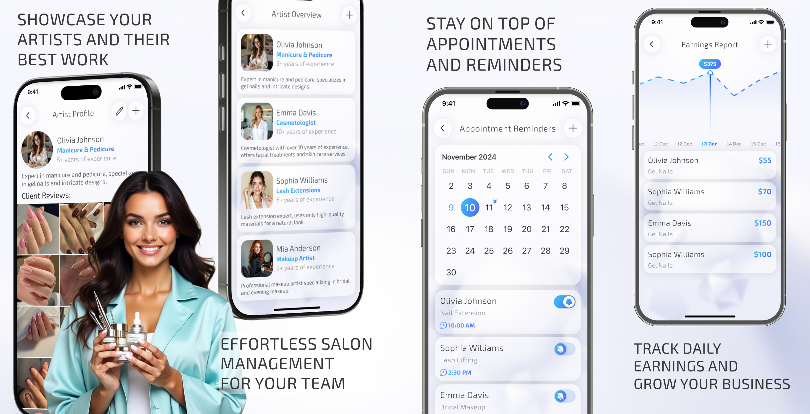
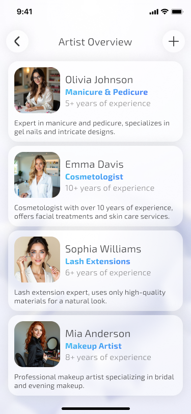
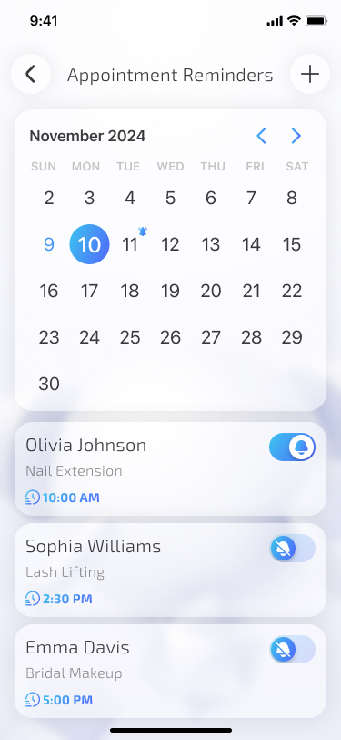
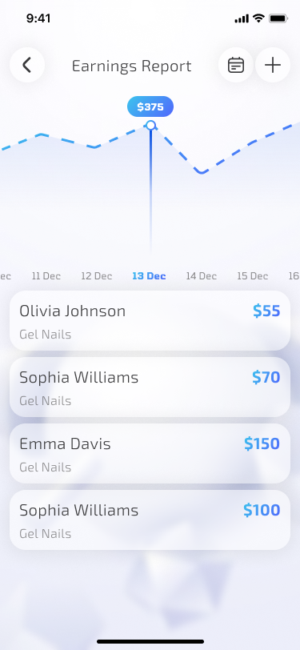

# SalonMate: Your Salon

**SalonMate** is a Flutter app that empowers beauty salons to manage their team, appointments, and income — all in one intuitive interface. Showcase your artists, organize bookings, and never miss a client.



## 🛠️ Technologies

- **Flutter** and **Dart**
- **Provider** — efficient state management
- **Hive** — local database for storing masters, income, reviews
- **Local notifications** — appointment and task reminders
- **Responsive UI** — adaptive layout with Flutter ScreenUtil
- **Modular design** — reusable widgets, clean architecture

## 📱 Screenshots

| Artist Overview                               | Appointment Reminders                    | Earnings Report                             |
|-----------------------------------------------|------------------------------------------|---------------------------------------------|
|  |  |  |

## 🚀 How to Run

1. Clone the repo
   ```sh
   git clone https://github.com/NMMustafina/salonmate_your_salon.git
   ```
2. Install all the packages by typing the following command
   ```sh
   flutter pub get
   ```
3. Run the App
